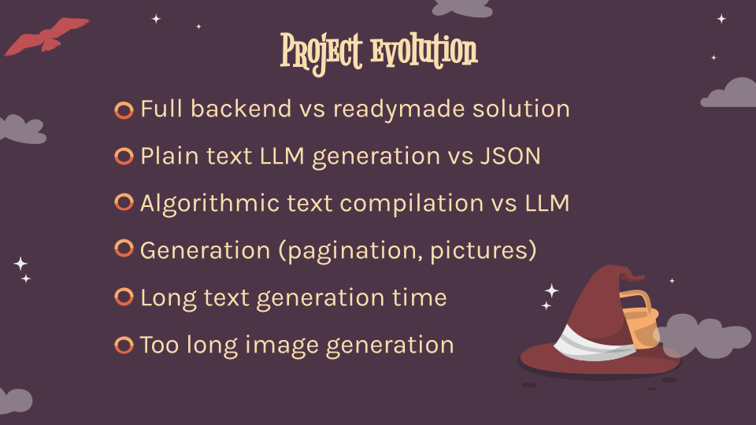

# MythPath

Introducing MythPath, an innovative app designed to make storytelling immersive and location-specific. MythPath utilizes AI to generate children’s stories based on real-world locations and personalized plot details. Whether you’re planning a family outing or a solitary walk, MythPath brings your journey to life through tales that teach, entertain, and inspire.

Key Features:

- Text & Media: Allows addition of textual descriptions and geotagged photos to enhance storytelling.
- Character Selection: Pre-set or custom characters to star in your tale.
- Message Input: Customizable messages or lessons to be included in the story (e.g., importance of handwashing).
  Dynamic Illustrations: Generate or choose illustrations for your story.

## Table Of Contents

- [Introduction](#intro)
- [Our team](#team)
- [Idea](#idea)
- [Demo](#demo)
- [Technologies](#technologies)
- [Tools and stats](#tools)
- [Project challenges](#challenges)
- [What's next](#plans)
- [Acknowledgements](#acknowledgements)

## Introduction

    

## Our team

    

[Marina](https://github.com/Aelmorka), [Rostislav](https://github.com/rostrskv), [Pavel](https://github.com/kondratovicz), [Dmitry](https://github.com/URBi1), [Evgeny](https://github.com/evgenynefedov)

## Idea

    

[Link to video](https://drive.google.com/file/d/1Ahr2Pj2o-vF7Jl9JDTe_yEwH0LOkqJAZ/view?resourcekey&usp=slides_web)

## Demo

    

[Link to the app](https://mythpath.xyz)

## Technologies

    

## Tools and stats

    

## Project challenges

    

## What's next?

    

## Acknowledgements

    

